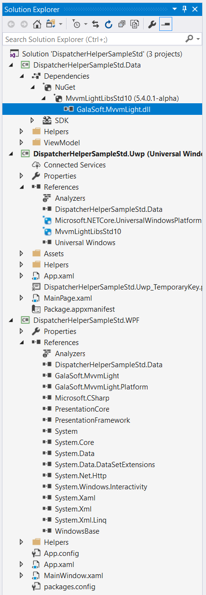
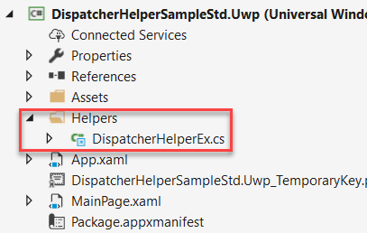

# Using the #mvvmlight DispatcherHelper in your .NET Standard libraries

You might have heard that MVVM Light is [now available as a .NET Standard 1.0 package](http://www.mvvmlight.net/std10), which means that you can use it in all your .NET Standard libraries (including 1.0, 1.4, 2.0 etc). Since .NET Standard is always backwards compatible, having MVVM Light running on .NET Standard 1.0 is quite convenient.

Already before, when we were using MVVM Light with Portable Class Libraries (PCL), we had to take the platform components in account. Platform components are components where the implementation differs depending on which platform/OS the application is built for. Unfortunately this is the case for the DispatcherHelper component, which uses a different implementation on WPF, UWP or Xamarin.

For .NET Standard, concretely, what this means is that the DispatcherHelper component lives in the GalaSoft.MvvmLight.Platform DLL and not into the shared GalaSoft.MvvmLight DLL. I have in my backlog to improve this situation (see below) but right now you can take advantage of DispatcherHelper in your .NET Standard library anyway with the following workaround.

> Note: I know about the “bait and switch” tactic, and can’t say I am a huge fan of it. See below the changes I propose to make to MVVM Light to improve the current situation.

## Inspecting the application with a .NET Standard library

The sample described here contains a WPF application and a UWP application, both using the .NET Standard data library. As you can see in the sample, we have the following Solution:



The following references have been set up:

* A reference to the .NET Standard Data library was added to both the WPF and the UWP applications.
* [The MVVM Light Toolkit for .NET Standard Nuget package](https://www.nuget.org/packages/MvvmLightLibsStd10) was added to the WPF and UWP applications, as well as to the Data library.

Note that there is only one DLL in the MVVM Light Nuget package referenced by the Data library, while there are two DLLs (GalaSoft.MvvmLight and GalaSoft.MvvmLight.Platform) referenced by the WPF and by the UWP applications. The DispatcherHelper component is in the Platform DLL.

## The MVVM pattern in this application

The Model-View-ViewModel pattern is implemented in the following manner:

* The [MainViewModel](https://github.com/lbugnion/mvvmlight/blob/master/Samples/DispatcherHelperSampleStd/DispatcherHelperSampleStd.Data/ViewModel/MainViewModel.cs) contains a ```Time``` property which uses MVVM Light's ```Set``` method to raise the PropertyChanged event. 

* The [ViewModelLocator](https://github.com/lbugnion/mvvmlight/blob/master/Samples/DispatcherHelperSampleStd/DispatcherHelperSampleStd.Data/ViewModel/ViewModelLocator.cs) contains a reference (```Main```) to the MainViewModel for data binding.

* The [App.xaml](https://github.com/lbugnion/mvvmlight/blob/master/Samples/DispatcherHelperSampleStd/DispatcherHelperSampleStd/App.xaml) for the WPF application creates the ViewModelLocator in the Application resources.

* Similarly we also have the ViewModelLocator in the [UWP's App.xaml](https://github.com/lbugnion/mvvmlight/blob/master/Samples/DispatcherHelperSampleStd/DispatcherHelperSampleStd.Uwp/App.xaml)'s resources.

* The [MainPage.xaml](https://github.com/lbugnion/mvvmlight/blob/master/Samples/DispatcherHelperSampleStd/DispatcherHelperSampleStd.Uwp/MainPage.xaml) (for UWP) and the [MainWindow.xaml](https://github.com/lbugnion/mvvmlight/blob/master/Samples/DispatcherHelperSampleStd/DispatcherHelperSampleStd/MainWindow.xaml) (for WPF) use the ViewModelLocator's ```Main``` property as DataContext.

* In the same XAML documents, we databind the TextBlock's ```Text``` property to the ```Time``` property of the MainViewModel.

## Why dispatching?

The [MainViewModel](https://github.com/lbugnion/mvvmlight/blob/master/Samples/DispatcherHelperSampleStd/DispatcherHelperSampleStd.Data/ViewModel/MainViewModel.cs) contains the code running a clock in a background thread. This is seen in the Start method.

```CS
public void StartClock()
{
    _clockIsRunning = true;

    Task.Run(async () =>
    {
        while (_clockIsRunning)
        {
            await Task.Delay(1000);

            if (_clockIsRunning)
            {
                // TODO This should be dispatched
                var now = DateTime.Now;
                Time = $"{now.Hour:D2}:{now.Minute:D2}:{now.Second:D2}";
            }
        }
    });
}
```
Note that the ```Time``` property is assigned inside the background thread. This raises the PropertyChanged event, which will be detected by the databinding to update the TextBlock's ```Text``` property in the XAML user interface. In WPF, the databinding is automatically "translating" the event from the background thread to the UI (main) thread. This is called "dispatching". In UWP and other frameworks (such as Xamarin), the databinding does not do dispatching between threads automatically. If you run the Start Method as shown in the code snippet above, the UWP application will fail to update the UI, and the clock will stay at 00:00:00.

To fix this, we can use MVVM Light's DispatcherHelper, but  as explained before, we don't have access to it from within the Data library.

## Getting access to DispatcherHelper within the Data library

We can use a workaround to get access to DispatcherHelper within the Data library:

* In the Data library, add an interface named [IDispatcherHelper](https://github.com/lbugnion/mvvmlight/blob/master/Samples/DispatcherHelperSampleStd/DispatcherHelperSampleStd.Data/Helpers/IDispatcherHelper.cs). This interface has a single method called ```CheckBeginInvokeOnUi```.

* In the WPF application, we implement the IDispatcherHelper interface in a helper class that we name [DispatcherHelperEx](https://github.com/lbugnion/mvvmlight/blob/master/Samples/DispatcherHelperSampleStd/DispatcherHelperSampleStd/Helpers/DispatcherHelperEx.cs) (the Ex is only there to help differentiate from MVVM Light's DispatcherHelper class). The implementation is simply forwarding the call to MVVM Light as shown here. Yes this is unnecessarily complicated and we will improve this in a future version of MVVM Light (see below).

```CS
public class DispatcherHelperEx : IDispatcherHelper
{
    public void CheckBeginInvokeOnUi(Action action)
    {
        DispatcherHelper.CheckBeginInvokeOnUI(action);
    }
}
```

* We also add this same DispatcherHelperEx class into the UWP application, simply by sharing a link to the DispatcherHelperEx.cs class (see the Helper folder in the UWP application):



Finally, we can pass the instance of IDispatcherHelper to the Data library with the help of MVVM Light's SimpleIoc IOC container.

* We register the DispatcherHelperEx class in SimpleIoc in [the WPF application's App.xaml.cs](https://github.com/lbugnion/mvvmlight/blob/master/Samples/DispatcherHelperSampleStd/DispatcherHelperSampleStd/App.xaml.cs). We also take the occasion to initialize the DispatcherHelper.

```CS
static App()
{
    DispatcherHelper.Initialize();
    SimpleIoc.Default.Register<IDispatcherHelper, DispatcherHelperEx>();
}
```

* We also do the same in the [UWP application's App.xaml.cs](https://github.com/lbugnion/mvvmlight/blob/master/Samples/DispatcherHelperSampleStd/DispatcherHelperSampleStd.Uwp/App.xaml.cs) (see lines 68 and 69).

* In the MainViewModel, we can now gain access to the DispatcherHelper by modifying the ```Start``` method as shown here:

```CS
public void StartClock()
{
    _clockIsRunning = true;

    Task.Run(async () =>
    {
        while (_clockIsRunning)
        {
            await Task.Delay(1000);

            if (_clockIsRunning)
            {
                SimpleIoc.Default.GetInstance<IDispatcherHelper>()
                    .CheckBeginInvokeOnUi(() =>
                    {
                        var now = DateTime.Now;
                        Time = $"{now.Hour:D2}:{now.Minute:D2}:{now.Second:D2}";
                    });
            }
        }
    });
}
```

Thanks to these changes, the code setting the ```Time``` property is now safely dispatched to the UI thread, and the application runs as expected both in WPF and in UWP.

## Planned changes to MVVM Light to improve the current situation

Of course having to add IDispatcherHelper to your .NET Standard library and to implement it in your applications is annoying and this is something that we can improve in MVVM Light. This is why I have the following items in my backlog:

* Add the IDispatcherHelper interface into MVVM Light's core DLL (for both the .NET and the .NET Standard versions).

* Make DispatcherHelper implement IDispatcherHelper. This way we cut the need for the DispatcherHelperEx class.

* Auto-register DispatcherHelper with the SimpleIoc IOC container (in the ```DispatcherHelper.Initialize``` method).

* In the core DLL (both for the .NET and the .NET Standard version of MVVM Light), add a DispatcherHelper bridge class providing access to the functionality.

Hopefully these items will make using the DispatcherHelper much easier from a PCL or a .NET Standard library.
